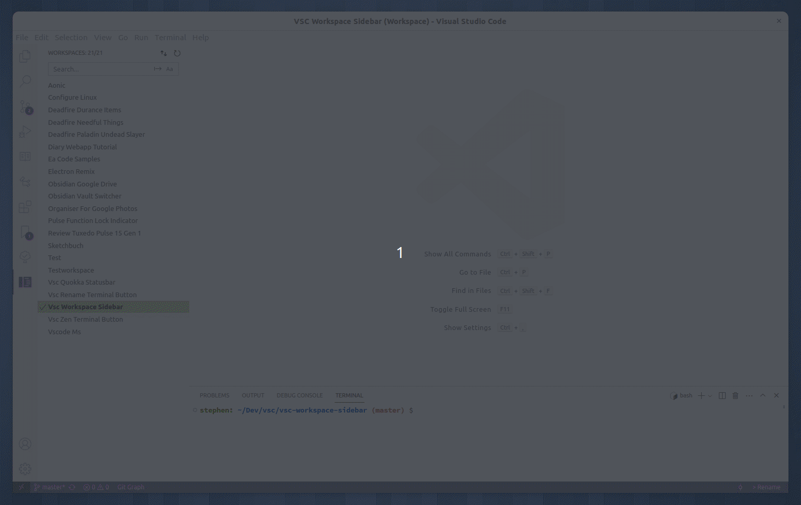

# Workspace Sidebar

An Extension for VSCode that makes switching Workspaces easier.

You can specify one or more folders to look in for Workspace files and these will be shown in a sidebar, either as a list or as a tree, along with file theme icons to better indentify workspaces.

You can then easily change Workspaces or open another Workspace in a new window.



## What's new in v2.0.0?

Firstly, multiple root folders are now supported. Previously only one root folder was possible. You can also override default values for depth and the exclusion of hidden folders. This took quite a rewrite as the entire extension was only built for one root folder.

```json
{
   "workspaceSidebar.rootFolders": [
      { "path": "/home/user/Apps", "excludeHiddenFolders": false},
      { "path": "~/Projects", "depth": 5}
      { "path": "/data/Dev"},
   ]
}
```

The root folder setting are now machine scoped to allow different machines (including remote) to have different root folders. This has the side-effect that they are no longer synced like other settings, so each machine will need to provide their own root folders config.

Secondly, symlinks are now usable. Previously they showed an error message about not being a folder. How path issues and handled in cases where folders are files, or not existing at all have also been improved.

Lastly, the documentation has been updated, not just the markdown but also the settings show more information particularly when they are arrays or objects.

[See the Changelog](CHANGELOG.md) for more detailed information.

## Features

The extension works by searching the root folders for `.code-workspace` files, and then displaying them as either a list or a tree.

### View Mode

**List View**

The Workspaces are just displayed for each root folder.


**Tree View**

A representation of the file tree is displayed, these can be collapsed/expanded in a similar way to the File Explorer in VSCode. The file tree can also be cleaned up to reduce visual noise, or displayed as is. In additon folders with only one child can be combined in a similar way to the File Explorer to reduce the number of folders displayed.


### Search

A search box is provided to allow you to search for a specific Workspace.


### File Theme Icons

File icons are displayed based on a simple substring match against the file path. No need to configure each file icon separately.


[More information about the file theme config](docs/File%20Icon%20Themes.md)

## Configuration

This is a summary of the available configuration options. [View detailed configuration documentaion.](./docs/Configuration.md)

### General

| Setting                | Description                                                                                                                                                                                             | Default Value  | Type          |
| ---------------------- | ------------------------------------------------------------------------------------------------------------------------------------------------------------------------------------------------------- | -------------- | ------------- |
| Actions                | The default action when clicking on a workspace. By default, clicking opens the workspace in the current window and the icon click in a new window. You can use this setting to reverse this behaviour. | Current Window | Dropdown List |
| Clean Labels           | Should workspace labels be converted to Title Case? If not their filename will be used as-is.                                                                                                           | True           | Boolean       |
| Depth                  | The depth of subfolders to search when looking for Workspace files. This can be overriden per root folder.                                                                                                                                                     | 0              | Number 0-25   |
| Show File Icons        | Show icons from the active file icon theme.                                                                                                                                                             | true           | Boolean       |
| Show File Icons Config | Config for file icon matching. See [File Icon Themes](./docs//File%20Icon%20Themes.md) documentation for more information.                                                                              | {}             | Object        |
| Show Paths             | Show the paths to the workspaces in the sidebar. Available options are: 'Always', 'Never', 'As needed'. This will only display paths if there are duplicate labels in the same folder.                  | As Needed      | Dropdown List |

### Folders

| Setting                | Description                                                                                                                                                                        | Default Value                                                          | Type                               |
| ---------------------- | ---------------------------------------------------------------------------------------------------------------------------------------------------------------------------------- | ---------------------------------------------------------------------- | ---------------------------------- |
| Exclude Hidden Folders | Should hidden folders be excluded when looking for workspaces? This can speed up searching, however, if you turn this option off you may need to excluded many folders. This can be overriden per root folder.   | True                                                                   | Boolean                            |
| Excluded       | Folders to exclude when searching for workspace files                                                                                                                              | [ "node_modules", "build", "dist", "out", "public", ".cache", ".git" ] | Array              |
| Root Folders           | The folders to look for workspace files in. **~/** will also be replaced with your home folder in all folders within the array.                                                    | []                                                                     | Array |

### Search

| Setting          | Description                                                                                                                                | Default Value | Type         |
| ---------------- | ------------------------------------------------------------------------------------------------------------------------------------------ | ------------- | ------------ |
| Case Insensitive | Should searching be case insensitive?                                                                                                      | False         | Boolean      |
| Match Start      | Should searching start from the beginning of the workspace label? False means matches will be looked for anywhere within workspace labels. | False         | Boolean      |
| Search minimum   | The minimum number of workspaces required before the search box is displayed. 0 Will always display the search box.                        | 15            | Number 0-100 |

### Tree View

| Setting               | Description                                                                                                                                                                            | Default Value | Type    |
| --------------------- | -------------------------------------------------------------------------------------------------------------------------------------------------------------------------------------- | ------------- | ------- |
| Condense File Tree    | Reduce visual noise by removing sufolders with only one workspace in. These workspace files will then be shown in their parent folder. Tree View only. | True          | Boolean |
| Show Folder Hierarchy | Display a file tree of workspaces with collapsable folders instead of the default list.                                                                                                | False         | Boolean |

## Translations

This extension is localised, if you want it in your language please send me a translated "package.nls.json" file which you can find in the root of this extension.

## Development

If you are intersted in contributing:

- Fork or clone the repo.
- Install dependencies
- Run tests or run a development version via the debugger launch panel.
  - Tests can't be run via the node script in package.json
  - Output of tests is found in the termial Debug Console tab
  - Run tests on Linux, Mac, and Windows.
  - Lint and typechecking commands exist
  - Typecheck will be run by the launch scripts before
    running tests
  - If using file paths, don't hard code the folder separators, use path.join() instead.
    ```javascript
    // This will fail in a test on windows:
    const myPath = '/home/user/dev'
    expect(getPathToDev()).to.equal(myPath)

    // Do this instead:
    const myPath = path.join('home', 'user', 'dev')
    expect(getPathToDev()).to.equal(myPath)
    ```
- You can package a test version of the extension as a vsix file using the command: `vsce package`.
  - Test the VSIX on Linux, Mac, and Windows.
- [Sample colours and CSS variable names](./docs/Colours.md)

## Todo

- Check if SSH machines add to the wrong config (open unsaved ws)
- Folder Path examples - add windows example
- Add buymeacoffee etc like bookmarks readme