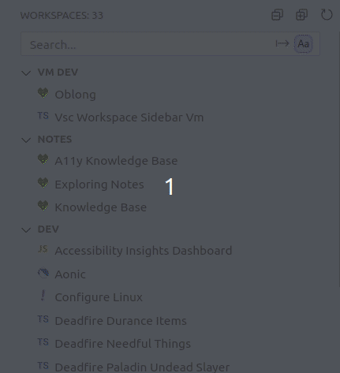
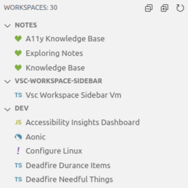
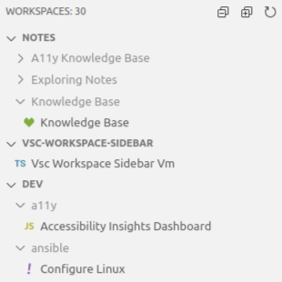
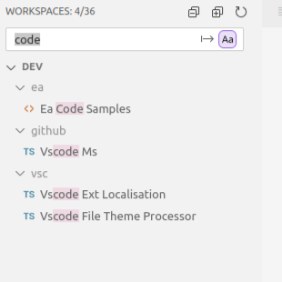
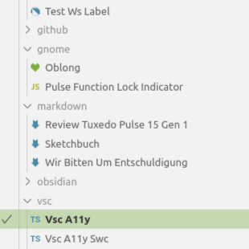

# Workspace Sidebar

An extension for VSCode to switch Workspaces with ease.

You can specify one or more folders to look in for Workspace files and these will be shown in a sidebar, either as a list or as a tree, along with file theme icons to better indentify workspaces.

You can then easily change Workspaces or open another Workspace in a new window.



## What's new in v2.1.0?

- Fix never ending loading indicator for fileicons if there was an error collecting theme.
- Fixed fileicons erroring of an extension didn't have contribution points in its package json.

[See the Changelog](CHANGELOG.md) for a complete version history.

## Features

The extension works by searching the root folders for `.code-workspace` files, and then displaying them as either a list or a tree.

### View Mode

**List View**

The Workspaces are displayed for each root folder in a list.



**Tree View**

A representation of the file tree is displayed, these can be collapsed/expanded in a similar way to the File Explorer in VSCode. The file tree can also be cleaned up to reduce visual noise, or displayed as is. In additon folders with only one child can be combined in a similar way to the File Explorer to reduce the number of folders displayed.



### Search

A search box is provided to allow you to search for a specific Workspace.



### File Theme Icons

File icons are displayed based on a simple substring match against the file path. There is no need to configure file icons for each workspace separately.



[More information about the file theme config](docs/File%20Icon%20Themes.md)

## Configuration

This is a summary of the available configuration options. [View detailed configuration documentaion.](./docs/Configuration.md)

### General

| Setting                | Description                                                                                                                                                                                             | Default Value  | Type          |
| ---------------------- | ------------------------------------------------------------------------------------------------------------------------------------------------------------------------------------------------------- | -------------- | ------------- |
| Actions                | The default action when clicking on a workspace. By default, clicking opens the workspace in the current window and the icon click in a new window. You can use this setting to reverse this behaviour. | Current Window | Dropdown List |
| Clean Labels           | Should workspace labels be converted to Title Case? If not their filename will be used as-is.                                                                                                           | true           | Boolean       |
| Depth                  | The depth of subfolders to search when looking for Workspace files. This can be overriden per root folder.                                                                                              | 0              | Number 0-25   |
| Focus Explorer                  | After opening a Workspace in a new window, switch to Explorer view instead of remaining on Workspace Sidebar's view.                                                                                             | false              | Boolean   |
| Show File Icons        | Show icons from the active file icon theme.                                                                                                                                                             | true           | Boolean       |
| Show File Icons Config | Config for file icon matching. [More information](./docs/Configuration.md#show-file-icons-config).                                                                                                      | {}             | Object        |
| Show Paths             | Show the paths to the workspaces in the sidebar. Available options are: 'Always', 'Never', 'As needed'. This will only display paths if there are duplicate labels in the same folder.                  | As Needed      | Dropdown List |

### Folders

| Setting                | Description                                                                                                                                                                                                        | Default Value                                                          | Type    |
| ---------------------- | ------------------------------------------------------------------------------------------------------------------------------------------------------------------------------------------------------------------ | ---------------------------------------------------------------------- | ------- |
| Exclude Hidden Folders | Should hidden subfolders be excluded when looking for workspaces? This can speed up searching, however, if you turn this option off you may need to excluded many folders. This can be overridden per root folder. | true                                                                   | Boolean |
| Excluded               | Subfolders to exclude when searching for workspace files                                                                                                                                                           | [ "node_modules", "build", "dist", "out", "public", ".cache", ".git" ] | Array   |
| Root Folders           | The folders to look for workspace files in. [More information](./docs/Configuration.md#root-folders).                                                                                                              | []                                                                     | Array   |

### Search

| Setting          | Description                                                                                                                                | Default Value | Type         |
| ---------------- | ------------------------------------------------------------------------------------------------------------------------------------------ | ------------- | ------------ |
| Case Insensitive | Should searching be case insensitive?                                                                                                      | false         | Boolean      |
| Match Start      | Should searching start from the beginning of the workspace label? False means matches will be looked for anywhere within workspace labels. | false         | Boolean      |

### Tree View

| Setting               | Description                                                                                                                                                                                                          | Default Value | Type    |
| --------------------- | -------------------------------------------------------------------------------------------------------------------------------------------------------------------------------------------------------------------- | ------------- | ------- |
| Condense Tree         | Reduce visual noise by removing sufolders with only one workspace in. These workspace files will then be shown in their parent folder. Tree View only. [More information](./docs/Configuration.md#condense-folders). | true          | Boolean |
| Show Folder Hierarchy | Display a file tree of workspaces with collapsable folders instead of the default list.                                                                                                                              | false         | Boolean |

## Translations

This extension is localised, if you want it in your language please send me a translated "package.nls.json" file which you can find in the root of this extension.

## Development

If you are intersted in contributing:

- Fork or clone the repo.
- Install dependencies
- Run tests in a development version of VSCode via the debugger launch panel.
  - Tests can't be run via the node script in package.json as a full instance of VSCode is needed.
  - Output of tests is found in the termial Debug Console tab
  - Run tests on Linux, Mac, and Windows.
  - Typecheck will be run by the launch scripts before
    running tests
- If using file paths, don't hard code the folder separators, use path.join() instead.

  ```javascript
  // This will fail in a test on windows:
  const myPath = '/home/user/dev'
  expect(getPathToDev()).to.equal(myPath)

  // Do this instead:
  const myPath = path.join('home', 'user', 'dev')
  expect(getPathToDev()).to.equal(myPath)
  ```

- If just testing functions that do not use VSCode or just using VSCode types, you can run `mocha:compile` and then `mocha:test` to test - but if you use any part of the VSCode API (**inc. ENUMs**) then you will need to run the tests via the debugger.

- You can package a test version of the extension as a vsix file using the command: `vsce package`.
  - Test the VSIX on Linux, Mac, and Windows.
- Lint and typechecking commands exist
- [Sample colours and CSS variable names](./docs/Colours.md)

## Support

If you use this plugin and want to help support development, please [PayPal Me](https://www.paypal.com/paypalme/stephenbungert).