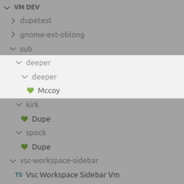
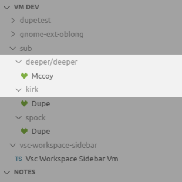
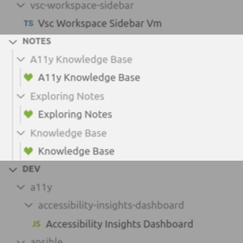
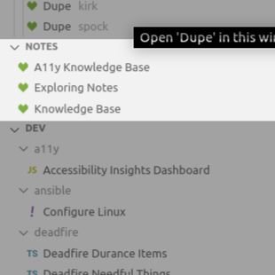

# Configuration

[Back to Readme](../README.md)

More information about certain configuration options that don't fit into the table on the readme.

## Compact Folders

Tree view respects the explorer setting "Compact Folders".
This will combine empty folders in the tree into one folder:

| Without Compact                | With Compact  |
| ---------------------- | ---------------------------- |
| |   |

This is an explorer setting and not part of this extension's settings.

## Condense Folders

Condense will render workspaces in their parent folder if there is only one workspace in a folder:

| Without Condense                | With Condense  |
| ---------------------- | ---------------------------- |
| |   |

# Root Folders

v2.0.0 allows multiple root folders. These are specified in an array of objects like this:

```json
{
  "workspaceSidebar.rootFolders": [
    { "path": "/home/user/apps", "excludeHiddenFolders": false}
    { "path": "/home/user/projects", "depth": 2}
    { "path": "/home/user/dev"}
  ]
}
```

### Root Folder

- **path** *string* (required)
  - The absolute path to a folder
  - There is no variable substitution, but "~/" can be used on Mac/Linux instead of "/home/user/"

- **depth** *int*

  - The depth of subfolders to search. This overrides `workspaceSidebar.depth`
  - The integers can range from 0-25

- **excludeHiddenFolders** *bool*

  - Should hidden folders be skipped when searching for Wokpsaces? This overrides `workspaceSidebar.excludeHiddenFolders`
  - Searching hidden folders can slow down the search

### Paths

In addition to normal folders, some other kinds of folders work too:

- **Windows**:
  - Junctions/SymLinks can be used
  - *Shortcuts don't work*
  - *Hard Links not tested*
- **Mac**:
  - SymLinks can be used
  - *Aliases don't work*
  - *Hard Links not tested*
- **Linux**
  - SymLinks can be used
  - *Hard Links not tested*

## Show File Icons Config

File icons are displayed based on substring matches against the file path to Workspaces.

Keys are languages or file types and each kay can match a number of strings.

```json
  "workspaceSidebar.showFileIconsConfig": {
    "language": ["keyword", "keyword"],
    "filetype": ["keyword"],
  }
```

Some examples might look like:

```json
  "workspaceSidebar.showFileIconsConfig": {
    "react": ["redux"],
    "ts": ["vsc", "electron"],
  }
```

And these would match as follows:

```json
  // Matches "react" icon - "redux" mathes
  /home/users/Dev/react/redux/counter/counter.code-workspace

  // Matches "ts" icon - "vsc" matches
  /home/users/Dev/vsc/extension.code-workspace

  // Matches "ts" - "electron" matches as deeper folders are checked first.
  /home/users/Dev/react/redux/electron/nextjs-app/na.code-workspace
```

[More information about file icons](./File%20Icon%20Themes.md)